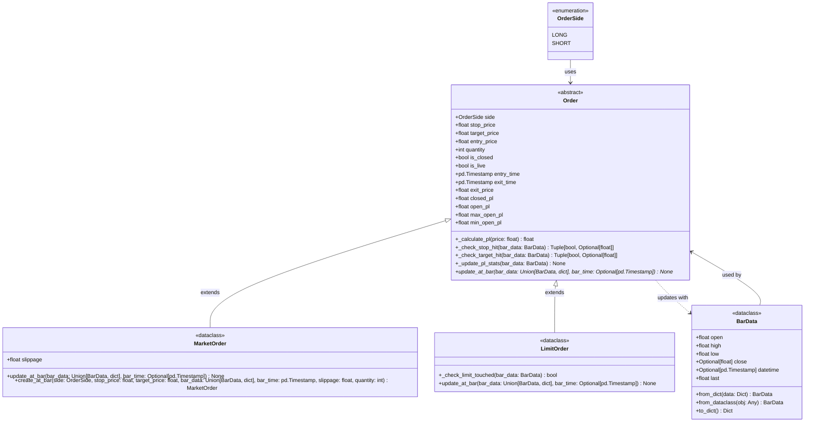

# Backtester Class Diagram

This document shows the UML class diagram for the backtester framework.

## Class Descriptions

### OrderSide (Enum)
Enumeration for order direction:
- `LONG`: Long position
- `SHORT`: Short position

### BarData (Dataclass)
Typed structure for OHLC bar data with IDE autocompletion support:
- Core fields: `open`, `high`, `low`, `close`, `datetime`
- Property: `last` (alias for `close`)
- Factory methods: `from_dict()`, `from_dataclass()`
- Conversion: `to_dict()`

### Order (Abstract Base Class)
Base class for all trading orders:
- Tracks order status (`is_live`, `is_closed`)
- Tracks P&L statistics (`open_pl`, `closed_pl`, `max_open_pl`, `min_open_pl`)
- Assumes worst-case OHLC ordering for fills
- Abstract method: `update_at_bar()` must be implemented by subclasses

### MarketOrder
Market order that fills immediately:
- Entry price = bar open ± slippage
- Becomes live immediately upon creation
- Factory method: `create_at_bar()` for convenient creation

### LimitOrder
Limit order that activates when price touches limit:
- Entry price is the limit price (known at construction)
- Starts inactive until limit is touched
- Becomes live when price touches limit within a bar

## Relationships

- **OrderSide → Order**: Orders use `OrderSide` enum to specify direction
- **Order ← MarketOrder/LimitOrder**: Both order types extend the abstract `Order` class
- **BarData → Order**: Orders use `BarData` objects to update their state
- **Order ..> BarData**: Orders receive `BarData` as input for updates (dependency)

